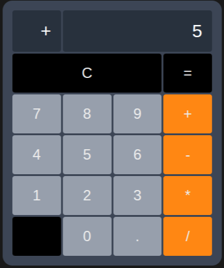

# Calculadora Mobile

Projeto simples de uma calculadora mobile desenvolvida para rodar na web.

# Como rodar o projeto

1. Instale as dependências:

```bash
npm install
```

2. Rode o projeto:

```bash
npm run web
```

3. Abra no navegador:

```
http://localhost:8081
```
(Essa é a porta padrão, verifique o terminal para informações sobre o url correto)
---

## Tecnologias

* React Native
* JavaScript / TypeScript
* Node.js

---

## Observações

* Certifique-se de ter o **Node.js** instalado.

---

Requisitos - Calculadora Mobile

 -> Objetivo:

Detalhar funcionalidades de uma calculadora para dispositivos mobile

Requisitos funcionais:

1 - Números: A calculadora deve ser capaz de representar números inteiros e números de ponto flutuante (com partes decimais separadas por “,”);

2 - Operadores: É importante que haja a presença de todos os operadores básicos, “+”, “-”, “/”, “*”;

3 - Calcular e apagar: Devem haver botões de “=”, para apresentar o resultado final, “C” para limpeza do display e “CE”, para apagar apenas 1 dígito;

4 - Display: Deve haver um display que mostra tanto os números quanto o operador atualmente selecionado. Quando o botão “=” for pressionado, apenas o resultado deve aparecer.

Requisitos não funcionais:

1 - O sistema deve responder instantâneamente aos comandos do usuário, com atraso imperceptível;

2 - O sistema deve tratar e lidar com erros corretamente;

3 - Os ícones relativos aos botões devem ser intuitivos e facilmente identificáveis.


Protótipo:



